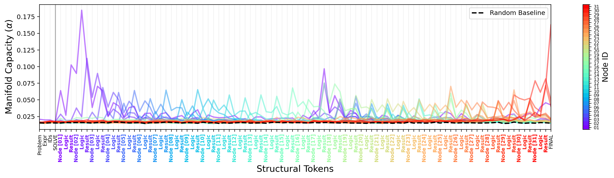
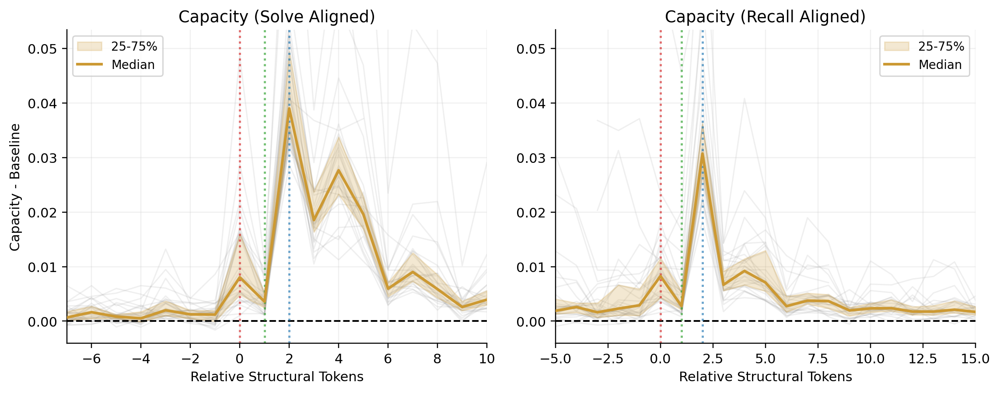
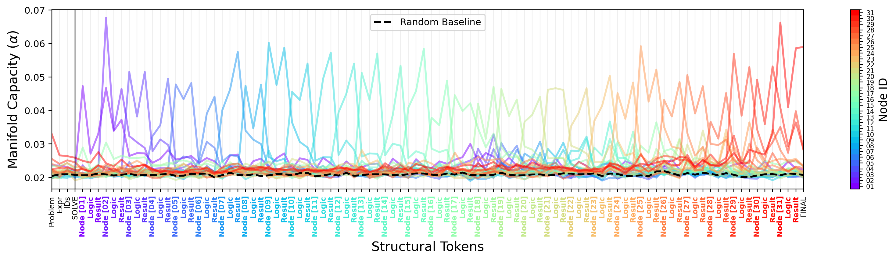
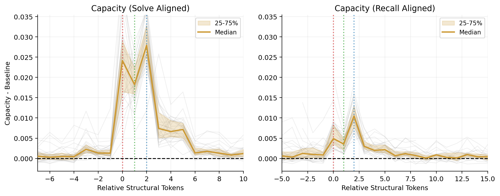
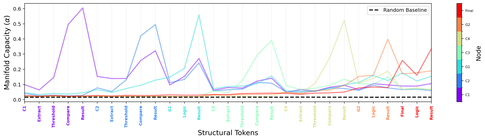
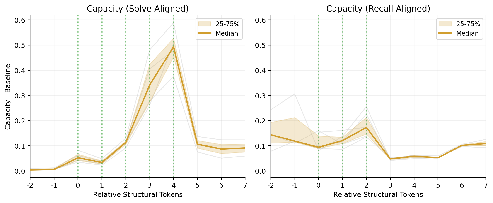
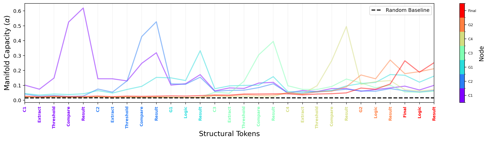
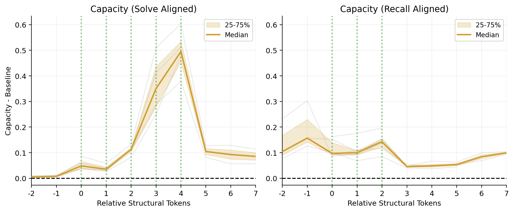

# Rebuttal Figures

This repository contains the figure set prepared for the rebuttal.

It includes:
- Boolean task figures for `Qwen2.5-14B-Instruct`
- Boolean task figures for `gpt-oss-20b`
- Eligibility task figures for `Ministral 3 8B Reasoning` with the standard prompt
- Eligibility task figures for `Ministral 3 8B Reasoning` with the silenced group-logic prompt

An example eligibility question is available here:
- [Eligibility Example Question](examples/eligibility_example_question.md)

Additional note for the unstructured natural-language eligibility analysis:
- [Eligibility Task: Ministral, Unstructured Natural-Language Output](eligibility_unstructured_ministral.md)

## Boolean: Qwen2.5-14B-Instruct

Task metadata:
- Task: Boolean tree
- Model: `Qwen2.5-14B-Instruct`
- Prompt used in this run: standard prompt
- Capacity layer shown: `26`

| Full Capacity Traces | Aligned Capacity Traces |
| --- | --- |
|  |  |

Download:
- [Full traces PDF](figures/boolean_qwen25_14b/full_traces.pdf)
- [Aligned traces PDF](figures/boolean_qwen25_14b/aligned_traces.pdf)

## Boolean: gpt-oss-20b

Task metadata:
- Task: Boolean tree
- Model: `gpt-oss-20b`
- Prompt used in this run: standard prompt
- Capacity layer shown: `13`

| Full Capacity Traces | Aligned Capacity Traces |
| --- | --- |
|  |  |

Download:
- [Full traces PDF](figures/boolean_gpt_oss_20b/full_traces.pdf)
- [Aligned traces PDF](figures/boolean_gpt_oss_20b/aligned_traces.pdf)

## Eligibility: Ministral Standard Prompt

Task metadata:
- Task: Eligibility assessment
- Model: `Ministral 3 8B Reasoning`
- Prompt used in this run: `eligibility_system_prompt`
- Capacity layer shown: `20`

| Full Capacity Traces | Aligned Capacity Traces |
| --- | --- |
|  |  |

Download:
- [Full traces PDF](figures/eligibility_ministral_standard/full_traces.pdf)
- [Aligned traces PDF](figures/eligibility_ministral_standard/aligned_traces.pdf)

## Eligibility: Ministral Silenced Group-Logic Prompt

Task metadata:
- Task: Eligibility assessment
- Model: `Ministral 3 8B Reasoning`
- Prompt used in this run: `eligibility_system_prompt_silenced_group_logic`
- Capacity layer shown: `20`

| Full Capacity Traces | Aligned Capacity Traces |
| --- | --- |
|  |  |

Download:
- [Full traces PDF](figures/eligibility_ministral_silenced/full_traces.pdf)
- [Aligned traces PDF](figures/eligibility_ministral_silenced/aligned_traces.pdf)
