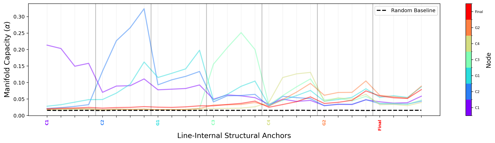
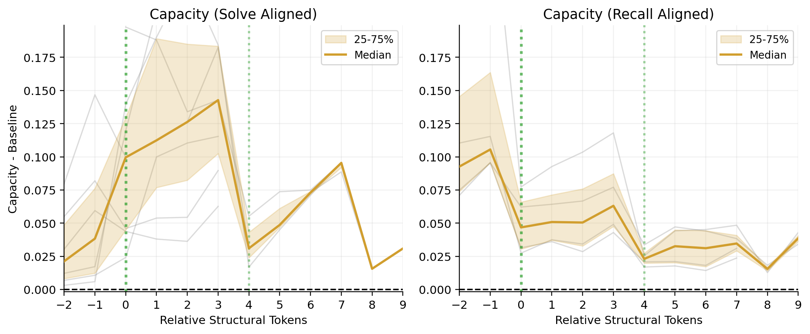

# Eligibility Task: Ministral, Unstructured Natural-Language Output

This page documents an additional rebuttal analysis on the eligibility task using `Ministral 3 8B Reasoning`, where the model is allowed to respond in natural language rather than the rigid field-by-field format used in the main structured eligibility experiment.

## Why This Analysis Was Added

One of the review concerns was that the original Boolean result might depend on a narrow combination of:
- a fixed binary-tree problem structure, and
- a rigid structured-CoT output format.

We had already added the eligibility task to address the first point. This additional analysis addresses the second point by changing the model's output format while keeping the underlying task generation process fixed.

## How The Eligibility Tasks Are Generated

A typical example gives the model a short applicant paragraph in ordinary prose and a set of eligibility rules. For instance, the paragraph may say that an applicant is 41 years old, earns `$63,000`, has a credit score of `730`, and has `$29,500` in savings, while the rules ask whether the applicant meets age, income, credit-score, and savings requirements, plus two combined requirements and a final eligible / not-eligible decision.

The dataset is generated by a Python script:
- [Python Generator](scripts/generate_eligibility_dataset.py)

That script first decides what the correct local and final outcomes should be for an example. It then samples concrete thresholds and applicant values that make those outcomes true, and renders them into a natural-language paragraph using varied templates, shuffled sentence order, and distractor attributes. This means that every example has known intermediate labels by construction, but the model still has to read the paragraph, recover the relevant facts, compare them to the criteria, and combine the resulting decisions.

The similarity to the Boolean task is therefore mainly at the level of controlled compositional generation: in both settings, the intermediate and final labels are fixed in advance so that traces can be aligned across examples. The main difference is that the Boolean task uses explicit Boolean literals, whereas the eligibility task replaces those with natural-language facts and threshold comparisons.

For a concrete example input, see:
- [Eligibility Example Question](examples/eligibility_example_question.md)

For a concrete example Ministral response in the unstructured setting, see:
- [Eligibility Example Response (Ministral)](examples/eligibility_example_response_ministral.md)

## Unstructured Output Variant

In this variant, the model is not asked to produce the rigid structured template used in the main eligibility analysis.

Instead:
- each reasoning line begins only with the item ID:
  - `C1:`
  - `C2:`
  - `G1:`
  - `C3:`
  - `C4:`
  - `G2:`
  - `Final:`
- the rest of each line is free natural language
- the output ends with:
  - `Final answer: ...`
  - `Violated criteria: ...`

For analysis, we sample line-internal anchors rather than rigid template tokens. Specifically, we choose five evenly spaced word-end anchors within each reasoning line, and for plotting we omit the first of those five anchors because it was dominated by stereotyped line-opening words and line-boundary effects.

This leaves four plotted anchors per reasoning line.

## Example Ministral Response

Below is a representative response from `Ministral 3 8B Reasoning` in this unstructured-output setting:

```text
C1: Brian Hawkins is 41 years old, which meets the requirement of age ≥ 40.
C2: He earns $63,000 per year, which is at least $60,000, so this item is met.
G1: Both C1 and C2 are met, so this item is met.
C3: His credit score is 730, which is at least 720, so this item is met.
C4: He has $29,500 in savings, which is at least $25,000, so this item is met.
G2: Both C3 and C4 are met, so this item is met.
Final: Since both G1 and G2 are met, the applicant is eligible.

Final answer: Eligible
Violated criteria: none
```

## Figures

Task metadata:
- Task: Eligibility assessment
- Model: `Ministral 3 8B Reasoning`
- Output format: unstructured natural-language lines with lightweight ID prefixes
- Capacity layer shown: `20`

| Full Capacity Traces | Aligned Capacity Traces |
| --- | --- |
|  |  |

Download:
- [Full traces PDF](figures/eligibility_ministral_unstructured/full_traces.pdf)
- [Aligned traces PDF](figures/eligibility_ministral_unstructured/aligned_traces.pdf)

## Main Observations

The main qualitative result is conserved:
- we still observe dynamic, node-specific manifold pulses in the natural-language task
- during the solve phase, each node's capacity rises when that subproblem is being worked on
- during recall, child-node capacity rises again while the parent node is being resolved

Compared with the structured eligibility figures, the overall capacity is more elevated across the full trace. We interpret the main result conservatively:
- the broader elevation likely reflects the denser semantic content of natural-language lines relative to rigid formatting tokens
- despite that broader elevation, the key dynamic pulse pattern remains visible

The recall-phase result is the most important point for the rebuttal:
- as in the structured setting, child-node capacity increases again during parent computation
- this indicates that the central temporal pattern is not tied to the original rigid answer template

## Additional Note On The First Within-Line Anchor

When we initially plotted all five within-line anchors, the first anchor in each line showed unusually high capacity in both the solve- and recall-aligned plots.

Inspection of the selected anchor words showed that this first anchor was usually a highly stereotyped line-opening token, such as:
- a name or pronoun: `Brian`, `Rachel`, `He`, `She`, `His`, `Her`
- a generic line starter: `Both`, `Since`, `The`, `Neither`

We therefore excluded that first anchor from the plotted version shown here, because it appears to reflect line-start lexical regularity and boundary effects more than the substantive computation in the line body.
